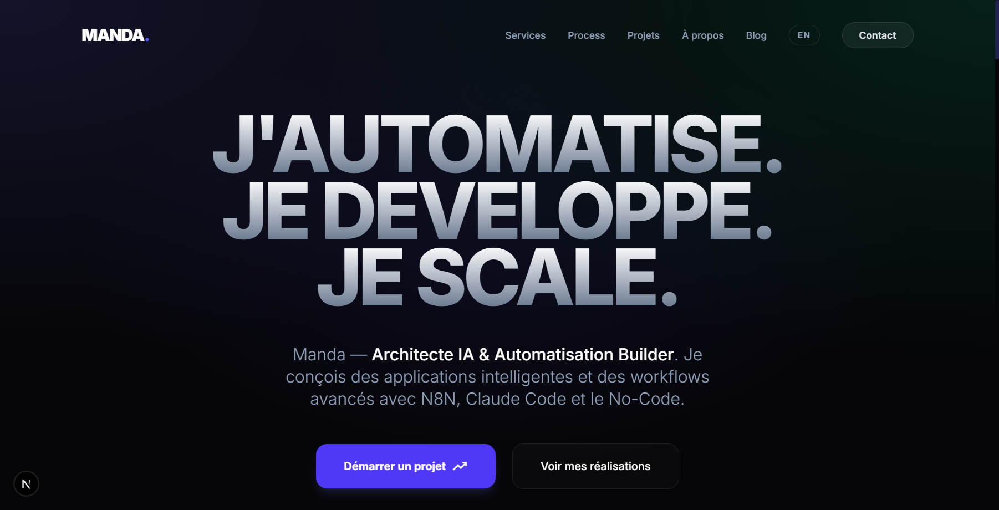

# Manda — Portfolio



Portfolio personnel de **Mandaniaina Randriambinintsoa** — Architecte IA & Automatisation Builder, basé à Antananarivo, Madagascar.

## Stack technique

| Technologie | Rôle |
|-------------|------|
| **Next.js 16** | Framework React (App Router, SSG/ISR, Turbopack) |
| **Tailwind CSS v4** | Styling utility-first + Typography plugin |
| **GSAP 3** | Animations scroll-triggered, parallax, stagger |
| **Supabase** | Base de données PostgreSQL, RLS, API temps réel |
| **PostHog** | Product analytics, parcours utilisateurs, heatmaps et session replays |
| **TypeScript** | Typage strict sur tout le projet |

## Fonctionnalites

- **10 sections homepage** : Hero, Command Center, Services, Process, Testimonials, Stats, Tech Stack, Projects (bento layout), FAQ, CTA Final
- **Blog dynamique** : Articles Markdown stockes dans Supabase, rendu avec `react-markdown` + syntax highlighting
- **8 projets** : Web apps & workflows N8N, stockes dans Supabase avec fallback JSON
- **i18n FR/EN** : Francais par defaut (`/`), anglais secondaire (`/en/`)
- **SEO optimise** : JSON-LD (Person, FAQ, BlogPosting, BreadcrumbList), sitemap dynamique, meta tags OpenGraph
- **Product analytics** : PostHog optionnel pour comprendre les parcours, clics, conversions et abandons
- **ISR** : Revalidation automatique toutes les heures + API de revalidation on-demand
- **Design** : Dark glassmorphism, animations fluides, responsive mobile-first

## Architecture

```
src/
  app/
    [locale]/          # Pages i18n (blog, projects, services, about, contact)
    api/revalidate/    # API ISR on-demand
    sitemap.ts         # Sitemap dynamique (blog + projets Supabase)
  components/
    animations/        # Wrappers GSAP (useGSAP + matchMedia)
    blog/              # BlogListingClient, MarkdownRenderer
    layout/            # Header, Footer, LanguageSwitcher
    sections/          # 10 sections homepage
    seo/               # JSON-LD components
    ui/                # GlassCard, Button, N8nWorkflowViewer
  lib/
    data/              # Data fetching (blog.ts, projects.ts, workflows/)
    supabase/          # Client serveur/browser, types auto-generes
  i18n/                # Config + dictionnaires FR/EN
```

## Demarrage rapide

```bash
# Installer les dependances
npm install

# Configurer les variables d'environnement
cp .env.example .env.local
# Remplir NEXT_PUBLIC_SUPABASE_URL, NEXT_PUBLIC_SUPABASE_ANON_KEY, REVALIDATION_SECRET
# Optionnel : NEXT_PUBLIC_POSTHOG_KEY, NEXT_PUBLIC_POSTHOG_HOST
# Optionnel admin local : POSTHOG_PERSONAL_API_KEY, POSTHOG_PROJECT_ID

# Lancer en developpement
npm run dev

# Build production
npm run build
```

## Deploiement

Le site est deploye sur **Vercel** avec :
- Build automatique sur push `main`
- Variables d'environnement configurees dans le dashboard Vercel
- ISR pour le blog et les projets (revalidation 1h)

## Auteur

**Mandaniaina Randriambinintsoa**
- Architecte IA & Automatisation Builder
- Expert N8N, Claude Code, Next.js, Supabase
- Antananarivo, Madagascar

## License

Ce projet est sous licence MIT.
